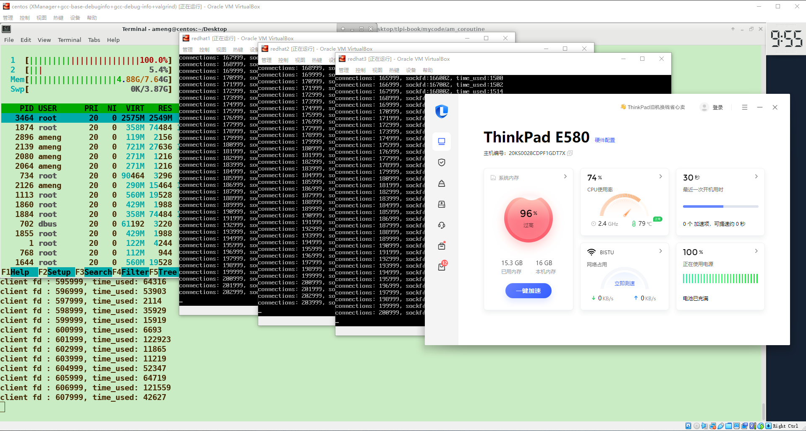
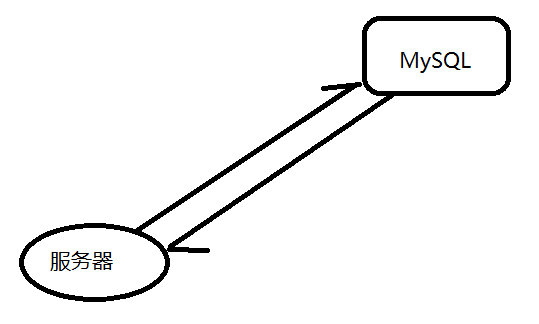
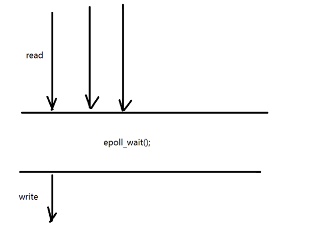
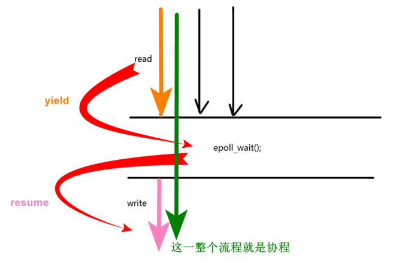
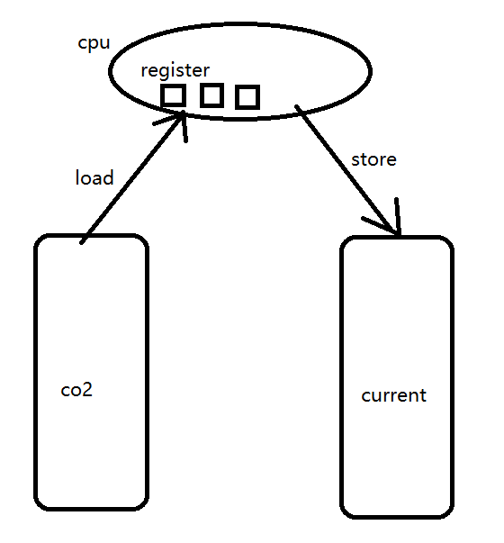
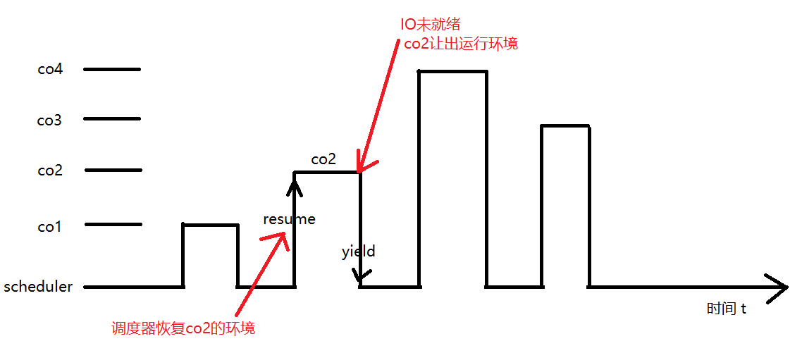
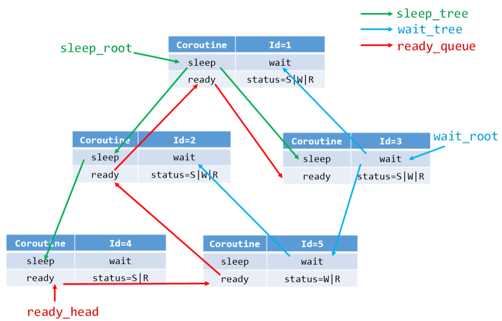

# am_coroutine, 一个简单易用的协程框架

## 0.协程的性能测试

测试环境：4台虚拟机

1台服务器8G内存，2核CPU

3台客户端2.5G内存，1核CPU

理论上讲，服务端需要的内存大小为：协程大小为240字节，协程私有栈大小为4096字节，TCP读和写缓冲区的总大小为4096字节，这样一百万的连接需要的内存大小为7.85G

100万的连接，平分到3个客户端，每个客户端需要34万的连接，这样单个客户端需要的内存大小为：4096B*340000约等于1.3G。

这样总的用于测试百万并发需要的内存大小为：7.85+1.3*3=11.75G

但由于Windows刚开机就占用了3.2G内存，加上虚拟机运行后的4G内存，这样百万并发我们实际需要的内存总大小是18.95G内存。

实际测试中，我的电脑跑到84万连接时，就因内存耗尽而卡死了。



## 1.为什么要有协程



在同步的模式下，服务器每发出一个请求，MySQL服务器就处理一个请求。其模式可用如下代码表示：

```c++
sync_process(void){
    read();
    parser();//数据处理
    write();
}
```

对于这种同步的方式，读操作和写操作处在同一个流程里面。如果读完数据后，写IO还没有就绪，那么就需要阻塞等待(必须是阻塞模式，如果是非阻塞模式，那么IO没有就绪，write会返回-1，这样就只进行了读操作而没有进行写操作)，直到写IO就绪后，才能进行写操作，这样就增加了等待IO就绪的时间。



对于异步模式，每次有read请求到来，就先检查对应的写IO是否就绪，如果没有就绪，epoll_wait返回0，就继续处理下一个read请求。然后再检测所有的写IO，如果有写IO就绪了，那么就开始处理写IO。

```C++
func(){
    while(1){
        int nready = epoll_wait(epfd,events,EVENT_SIZE,-1);
        for(int i=0;i<nready;++i){
            if(events[i].event & EPOLLIN){
                read();
                parser();
            }else if(events[i].event & EPOLLOUT){
                write();
            }
        }
    }
}
```

对于异步的方式，我read完一次后，不需要等write完，我依然可以继续read。

## 2.协程的原语操作



协程的原语操作有两个，一个是yield让出CPU，一个是resume恢复协程的运行。

yield：协程原本在运行，但因读IO没有就绪，所以让出CPU，swith到epoll_wait.

resume：当epoll_wait检测到写IO就绪的时候，就恢复某一个协程的运行。

## 3.协程的切换方式

什么时候进行协程的切换？每当遇到IO操作的时候，如果IO就绪了，那么我就处理。如果IO没有就绪，那就将其epoll_ctl到树中，然后切换到下一个协程。

协程常用的切换方式一般有三种：setjmp 和 longjmp、ucontext 上下文环境、asm code 汇编的方式。am_coroutine的协程切换采用的是汇编的方式。

协程切换的本质是对程序执行的上下文的保存和恢复，这涉及到对寄存器和协程的私有栈的操作。以x86-64为例，协程的切换需要保存的寄存器主要包括rsp、rbp、rbx、r12-r15 以及 rip。

- rsp(栈指针)：指向栈顶，即下一个可用的栈地址。在协程切换时，需要保存当前的栈指针值，以便在协程恢复的时候能够正确地访问其私有栈。
- rbp(栈底指针)：与 rsp 配合使用，用于访问栈上的数据。在协程切换时，也需要保存当前的栈底指针值。
- rbx, r12-r15：这些寄存器被视为数据寄存器，用于保存临时数据。在协程切换的过程中，这些寄存器的值也需要被保存，以确保协程恢复时的状态一致性。
- rip：程序运行的下一条指令的地址。在协程切换时，需要保存当前的指令指针值，以便在协程恢复时能够从正确的位置继续执行。

这些寄存器的保存和恢复是协程切换的核心部分，通过这些操作，可以实现协程的挂起和恢复，从而支持非阻塞IO、异步操作的功能。



先将寄存器的值保存到current中，然后再将co2中保存的值加载到CPU中。

## 4.协程的执行方式



假设当前有四个协程co1、co2、co3 和 co4 以及一个调度器 scheduler。

当协程co2的IO没有就绪时，co2让出CPU，让调度器运行，然后由调度器来决定下一个执行的协程。

## 5.如何使用该协程

在网络编程的时候，我们假设每次 accept 返回的时候，就为新到来的客户端分配一个线程，这样一个客户端就对应一个线程。就不会出现多个线程共用一个 cfd 的情况。但是这样大量的创建线程以及后续的调度，都会消耗巨大的资源。

一个客户端请求对应一个线程的代码如下：

```c++
while(1){
    socklen_t client_size = sizeof(struct sockaddr_in);
    int cfd = accept(lfd,(struct sockaddr*)&client_addr,&client_size);
    
    pthread_t thread_id;
    pthread_create(&thread_id,NULL,client_cb,&cfd);
}
```

如果我们使用协程，就可以这样实现：

```c++
while(1){
    socklen_t client_size = sizeof(struct sockaddr_in);
    int cfd = am_accept(lfd,(struct sockaddr*)&client_addr,&client_size);
    
    am_coroutine* read_co;
    am_coroutine_create(&read_co,server_reader,&cfd);
}
```

am_coroutine 封装了许多接口，一类是协程本身的，一类是POSIX的异步API。

1. 协程创建

   ```c++
   int am_coroutine_create(am_coroutine** new_co,proc_coroutine func,void* arg);
   ```

2. 运行调度器

   ```c++
   void am_schedule_run(void);
   ```

3. POSIX API 的异步封装

   ```c++
   int am_socket(int domain,int type,int protocol);
   int am_accept(int fd,struct sockaddr* addr,socklen_t* len);
   int am_recv(int fd,void* buf,int length);
   int am_send(int fd,const void* buf,int length);
   int am_close(int fd);
   ```

## 6.协程的工作流程

协程的内部是如何工作的呢？

### 6.1协程的创建

每当我们需要异步调用的时候，我们就创建一个协程。比如当 accept 返回一个新的 cfd 时，创建一个客户端处理的子过程。再比如需要监听多个端口的时候，创建一个 server 的子过程，这样多个端口是同时工作的。

```c++
int am_coroutine_create(am_coroutine** new_co,proc_coroutine func,void* arg);
```

new_co：传出参数，需要传入一个空的协程指针的地址，然后在函数内部会在堆上创建出一个协程，最后通过new_co传出该协程对象在堆上的地址。

func：协程的入口函数，当协程被调度的时候，就执行该函数。

arg：入口函数的参数。

### 6.2实现IO异步操作

```c++
while(1){
    int nready = epoll_wait(epfd,events,EVENT_SIZE,-1);
    for(int i=0;i<nready;++i){
        int sockfd = events[i].data.fd;
        if(sockfd == lfd){
            int cfd = accept(lfd,(struct sockaddr*)&client_addr,&client_size);
            setnonblock(cfd);
            ev.events = EPOLLIN | EPOLLET;
            ev.data.fd = cfd;
            epoll_ctl(epfd,EPOLL_CTL_ADD,cfd,&ev);
        }else{
            epoll_ctl(epfd,EPOLL_CTL_DEL,sockfd,NULL);
            recv(sockfd,buffer,length,0);
            send(sockfd,buffer,length,0);
            epoll_ctl(epfd,EPOLL_CTL_ADD,sockfd,NULL);
        }
    }
}
```

注意在IO操作(recv,send)之前，我们先执行了 epoll_ctl 的删除操作，将对应的 sockfd 从 epfd 中删除。然后在执行完 IO 操作之后，再执行 epoll_ctl 的添加操作，将 sockfd 重新添加到 epfd 中。

这段代码看似没什么作用，但是在多个上下文中，这样做可以保证 sockfd 只会存在于一个上下文中，不会出现在多个上下文中同时对一个 IO 进行操作。协程的 IO 异步操作正是采用该模式进行的。

协程的上下文 IO 异步操作(am_recv,am_send)函数的执行步骤如下：

1. 将 sockfd 添加到 epoll 树中。
2. 进行上下文的切换，从协程的上下文 yield 到调度器的上下文。
3. 调度器获取下一个协程的上下文，resume到新的协程。

### 6.3协程的子过程执行

在 create 协程之后，何时回调子过程？由于 CPU 中寄存器 rip 存放下一条要执行指令的地址。所以我们可以把回调函数的地址存储到 rip 中，将回调函数的参数存储到对应的参数寄存器 rdi,rsi,rdx,rcx,r8,r9 中。实现子过程调用的逻辑代码如下：

```c++
void _exec(am_coroutine* co){
    co->func(co->arg);//子过程的回调函数
}

void am_coroutine_init(am_coroutine* co){
    //ctx : 协程的上下文
    co->ctx.rdi = (void*)co;//第一个参数
    co->ctx.rip = (void*)_exec;//回调函数的入口
    //当实现上下文切换的时候，就会执行入口函数_exec, _exec会调用子过程func
}
```

## 7.协程的结构定义

新创建的协程加入到就绪队列(ready_queue)等待调度器的调度。协程运行时进行IO操作，如果此时IO未就绪，则进入等待树(wait_tree)。如果IO就绪，协程运行后进行sleep操作，则进入到睡眠树(sleeping_tree)中。

就绪队列不设置优先级，所以采用普通的队列就可以。睡眠树和等待树都需要按照时长进行排序，所以采用红黑树。数据结构如下：



```c++
typedef struct _am_coroutine{
	//CPU上下文
	am_cpu_ctx ctx;
	//协程要执行的函数
	proc_coroutine func;
	//上述函数参数
	void* arg;

	//协程的状态
	//am_coroutine_status status;
	uint32_t status;
	//调度器
	am_schedule* sched;
	//协程的创建时间
	uint64_t birth;
	//协程的唯一标识符
	uint64_t id;
	//文件描述符
	int fd;
	//文件描述符的事件类型
	unsigned short events;


	//协程的栈指针，指向协程的栈空间
	void* stack;
	//协程的栈的大小
	size_t stack_size;
	
	//协程下一次需要唤醒的时间，以微秒为单位
	uint64_t sleep_usecs;

	//用于在调度器的睡眠队列中排序协程
	RB_ENTRY(_am_coroutine) sleep_node;
	//用于在调度器的等待队列中排序协程
	RB_ENTRY(_am_coroutine) wait_node;

	//用于在调度器的就绪队列中排序协程
	TAILQ_ENTRY(_am_coroutine) ready_next;

}am_coroutine;
```

## 8.协程的调度器

调度器是用来管理协程的，调度器的结构如下：

```c++
typedef struct _am_schedule{
	//调度器的创建时间
	uint64_t birth;
	//CPU上下文
	am_cpu_ctx ctx;
	//栈指针，指向调度器私有栈的栈底
	void* stack;
	//栈的大小
	size_t stack_size;
	//已创建的协程数量
	int spawned_coroutines;
	//默认超时时间，单位微秒
	uint64_t default_timeout;
	//当前正在运行的协程
	struct _am_coroutine* curr_thread;

	//epoll文件描述符
	int epoll_fd;
	int eventfd;
	struct epoll_event eventlist[AM_CO_MAX_EVENTS];

	//新的就绪事件数量
	int num_new_events;

	//协程队列，存储就绪的协程
	am_coroutine_queue ready;

	//忙碌链表，存储忙碌的协程
	am_coroutine_link busy;
	
	//睡眠红黑树，存储睡眠的协程
	am_coroutine_rbtree_sleep sleeping;
	//等待红黑树，存储等待的协程
	am_coroutine_rbtree_wait waiting;
}am_schedule;
```

协程的调度策略采用的是多状态运行的策略。简单来说就是遍历睡眠树、就绪队列和等待树，只要它们不为空，那就从中选出一个协程来运行。其代码逻辑如下：

```c++
//只要还有没有执行完的协程
	while(!am_schedule_isdone(sched)){
		//1.从睡眠树中获取已经睡完的协程^_^
		am_coroutine* expired = NULL;
		//获取睡眠时间到期的协程
		while((expired = am_schedule_expired(sched)) != NULL){
			am_coroutine_resume(expired);
		}

		//2.就绪队列中的协程
		//获取就绪队列中的最后一个协程
		am_coroutine* last_co_ready = TAILQ_LAST(&sched->ready,_am_coroutine_queue);
		while(!TAILQ_EMPTY(&sched->ready)){
			//获取就绪队列中的第一个协程
			am_coroutine* co = TAILQ_FIRST(&sched->ready);
			//从就绪队列中移除该协程
			TAILQ_REMOVE(&co->sched->ready,co,ready_next);

			am_coroutine_resume(co);
			if(co == last_co_ready){
				break;
			}
		}

		//3.等待树中的协程
		am_schedule_epoll(sched);
		//如果有新的事件到来
		while(sched->num_new_events){
			int idx = --sched->num_new_events;
			struct epoll_event* ev = sched->eventlist + idx;

			int fd = ev->data.fd;
			am_coroutine* co = am_schedule_search_wait(fd);
			if(co != NULL){
				am_coroutine_resume(co);
			}
		}
```


